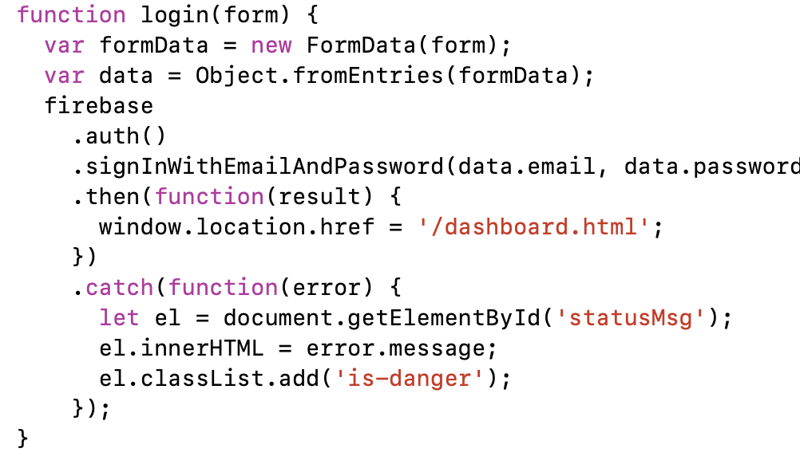
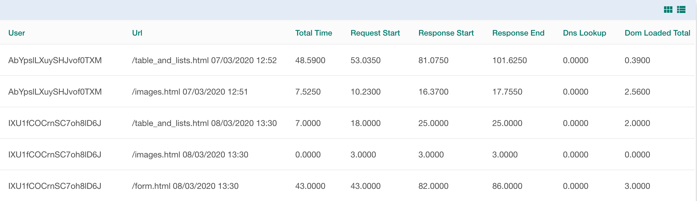
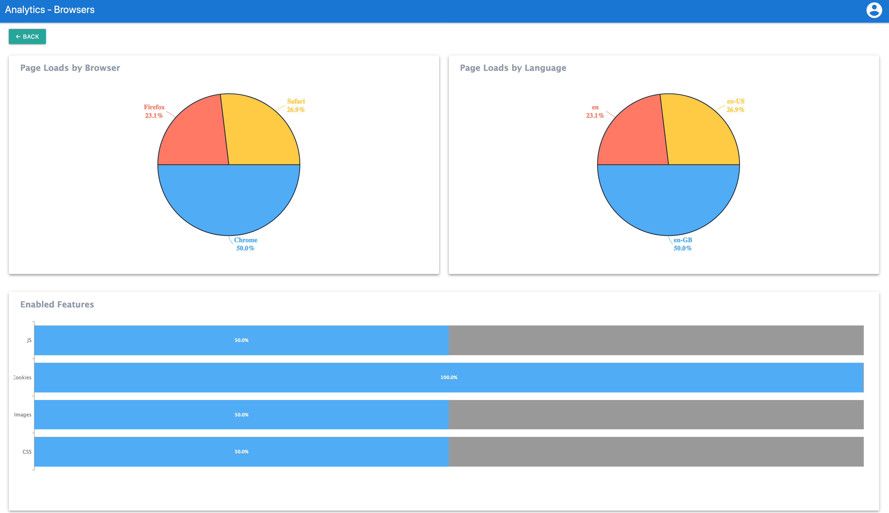

# CSE135FinalProject

Repo for the final project of cse 135 
Sepehr Foroughi Shafiei A14766011 
Shaya Parsa A13342802  
Simon Kaufmann A16140686  

Here is the link for our deployed project:
    
    https://cse135finalproject.firebaseapp.com

Admin Username and Password:
        
    Username: 135grader@ucsd.edu
    Password: 123123

Brief overview of your **authentication** code and how you implemented it (including any code or libraries you needed)

    We used the Firebase authentication system for all the users and
    admins. we manually create the first admin and the first admin has
    control to create new user accounts or other admin accounts.
    first admin plays the role of superuser.also admin can delete the
    user account.
    Our authentication system has logging through username (email) and
    passwords. Both admin and user have the ability to reset their
    passwords.
    If any user is not defined in our systems we redirect them to
    login.html
    Here is an overview of our code inside auth.js and it shows how we
    make authentications inside login page:

    Relevant files: /public/scripts/auth.js: in this file we are implementing authentications
                    /public/scripts/dashboard.js: in this file we are implementing data extraction
    from our database and prepare our data for chart and grid functions
                    /public/nav.js: this script is responsible for determining if the user is admin or not.
                    /public/setting.js: this script handles some logic for the settings page.
                    /public/users.js: this script handles CRUD operations on users. Only for admin users.

Diagram that shows how your PoC examples work together including their **routes**

    For our routing diagram since we used traditional html formating not SPA we showed
    all of our routing inside our wireframe in last part please refer to the diagram
    in last part. We considered using a framework like React to facilitate a single page
    web application, but decided that for this use case a few separate html pages
    for reporting and analytics work equally well and without the complexity overhead of
    a framework like React.

    Routing to the following pags through static files:
    /public/dashboard-new.html,
    /public/reports/browsers.html,
    /public/reports/events.html,
    /public/reports/speed.html

Discussion of the **grid library** you used
  
  
    For our grids, we used the table markdown of the Bulma CSS framework
    Zing Grid library.
    
Here is grid for speed Usage for demonstration purposes:

  
     Relevant Files:
        /public/scripts/dashboard.js,
                /public/scripts/speed.js,
                /public/scripts/browser.js,
                /public/scripts/event.js,
                /public/reports/browsers.html,
                /public/reports/speed.html,
                /public/reports/events.html,
                /public/showdb.html,
                /public/dashboard.html,
                /public/scripts/reportertest.js.

Discussion of the **chart library** you used

    For our chars, we will use Zing Chart. Zing Chart create animated &
    interactive charts with hundreds of thousands of data records.

    The library is imported into the html file and functions will be called
    from dashboard.js file. The dashboard.js file fetches data from the firestore
    database, calculates metrics (e.g. averages over page clicks by Browser, Language
    etc.) and then uses appropriate calls to the Zing Chart library to display the
    data on the dashboard.

Here is chart for Browser Usage for demonstration purposes:

    Relevant Files:
              /public/scripts/dashboard.js,
              /public/scripts/speed.js,
              /public/scripts/browser.js,
              /public/scripts/event.js,
              /public/dashboard.html,
              /public/reports/browsers.html,
              /public/reports/browsers.html,
              /public/reports/speed.html,

**Code of the PoC will be per area**

**Authentication**

    Relevant files: 
        /public/scripts/auth.js: in this file we are implementing authentications
        /public/scripts/dashboard.js: in this file we are implementing data extraction
    From our database and prepare our data for chart and grid functions
        /public/nav.js: this script is responsible for determining if the user is admin or not.
        /public/setting.js: this script handles some logic for the settings page.
        /public/users.js: this script handles CRUD operations on users. Only for admin users.

**Routing**
  
 Routing to the following pages through static files:
 
    Relevant Files:
        /public/dashboard.html,
        /public/reports/browsers.html,
        /public/reports/events.html,
        /public/reports/speed.html.

**Grid**

    Relevant Files:
        /public/scripts/dashboard.js,
        /public/scripts/speed.js,
        /public/scripts/browser.js,
        /public/scripts/event.js,
        /public/reports/browsers.html,
        /public/reports/speed.html,
        /public/reports/events.html,
        /public/dashboard.html.

**Charts**

    Relevant Files:
         /public/scripts/dashboard.js,
         /public/scripts/speed.js,
         /public/scripts/browser.js,
         /public/scripts/event.js,
         /public/dashboard.html,
         /public/reports/browsers.html,
         /public/reports/browsers.html,
         /public/reports/speed.html

App diagram and wireframes to implement for final project

Here is PDF format for app-diagram:

[App-dragram](/public/media/app-diagram.pdf)

Here is PDF format for wireframe:

[Wireframe](/public/media/wireframe.pdf)

Here is a link to better quality:

[Wireframe link](https://miro.com/welcomeonboard/r5cdFwjFBnVmmrWhmBXtH4ugCyHbD6nFNAlS5mwm1SmmzldW02ljha5rdDPDaFu0)
